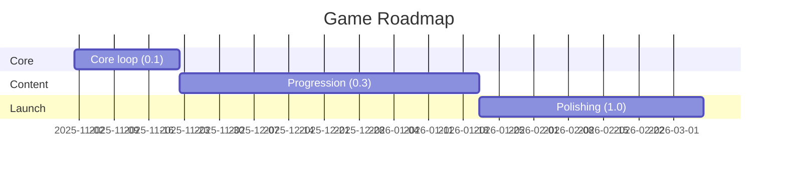

# Roadmap

> Keep this high-level and outcome-focused. Dates are estimates.

## Near Term (Next 2–4 weeks)
- **Version**: 0.1.0
- **Theme**: Core loop and feel
- **Goals**:
  - 

## Mid Term (1–3 months)
- **Version**: 0.3.0
- **Theme**: Content and progression
- **Goals**:
  - 

## Long Term (3–6+ months)
- **Version**: 1.0.0
- **Theme**: Launch readiness
- **Goals**:
  - 

## Timeline (Tentative)

